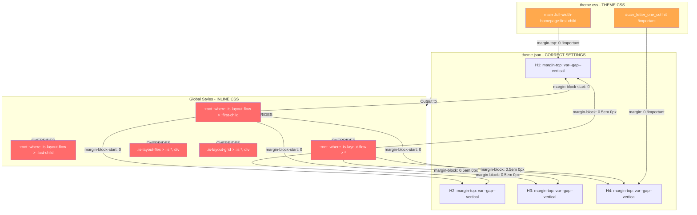

# Forensic Specificity Audit Report

## Executive Summary 

The theme.json typography settings ARE being correctly output to Global Styles (inline CSS), but they are being **systematically overridden** by Gutenberg's layout engine rules. The margins are being killed by `:where()` pseudo-class rules that target children of layout containers. 

---

## Task 1: The Winning Rule Trace

### H3 Inspection Results (Homepage)

| Property | Computed Value | theme.json Expected |
|----------|---------------|---------------------|
| font-size | 48px | `min(max(1.875rem, 5vw), 3rem)` ✓ Working |
| margin-top | **0px** | `var(--wp--custom--gap--vertical)` ✗ BROKEN |
| margin-bottom | **0px** | `var(--wp--custom--gap--vertical)` ✗ BROKEN |

**Winner Analysis:**
- The `h3` selector in Global Styles (inline) correctly sets:
  - `font-size: min(max(1.875rem, 5vw), 3rem)` 
  - `margin-top: var(--wp--custom--gap--vertical)`
  - `margin-bottom: var(--wp--custom--gap--vertical)`
- **BUT** computed values show 0px margins - something is overriding!

### H4 Inspection Results (Homepage)

| Property | Computed Value | theme.json Expected |
|----------|---------------|---------------------|
| font-size | 28px | `var(--wp--custom--font-size--normal)` ✓ Working |
| margin-top | **0px** | `var(--wp--custom--gap--vertical)` ✗ BROKEN |
| margin-bottom | **0px** | `var(--wp--custom--gap--vertical)` ✗ BROKEN |

### All Headings Test Page Results (/test/)

| Element | Computed font-size | Computed margin-top | Computed margin-bottom |
|---------|-------------------|--------------------|-----------------------|
| H1 | 72px | 0px | 0px |
| H2 | 64px | 0px | 0px |
| H3 | 48px | 0px | 0px |
| H4 | 20px | 0px | 0px |
| H5 | 16px | 0px | 0px |
| H6 | 14px | 0px | 0px |

**Key Finding:** Font-sizes ARE following theme.json (via clamp/minmax formulas). Margins are NOT.

---

## Task 2: The Margin Killer Search

### PRIMARY OFFENDERS - Gutenberg Layout Engine Rules

These rules from **Global Styles (inline CSS)** are killing heading margins:

```css
/* OFFENDER #1 - First child margin killer */
:root :where(.is-layout-flow) > :first-child {
    margin-block-start: 0px;
}

/* OFFENDER #2 - Last child margin killer */
:root :where(.is-layout-flow) > :last-child {
    margin-block-end: 0px;
}

/* OFFENDER #3 - ALL children margin killer */
:root :where(.is-layout-flow) > * {
    margin-block: 0.5em 0px;
}
```

**Source:** WordPress Core Block Library (injected as inline Global Styles)

**Why These Win:**
1. The `:where()` pseudo-class has **zero specificity** (0,0,0)
2. BUT they are applied via Global Styles which come AFTER theme.css in the cascade
3. The `:root` prefix gives them scope over the entire document
4. They directly target children of `.is-layout-flow` containers

### SECONDARY OFFENDERS - Flex/Grid Layout Rules

```css
/* OFFENDER #4 - Flex container children */
.is-layout-flex > :is(*, div) {
    margin: 0px;
}

/* OFFENDER #5 - Grid container children */
.is-layout-grid > :is(*, div) {
    margin: 0px;
}
```

**Source:** WordPress Core Block Library (inline Global Styles)

### TERTIARY OFFENDERS - Theme CSS

From [`sass/theme.scss`](sass/theme.scss):

```css
/* Line 368-376 - Section margin overrides */
main .full-width-homepage:first-child {
    margin-top: 0 !important;
    padding-top: var(--wp--custom--spacing--medium) !important;
}

main .full-width-homepage:last-child {
    margin-bottom: 0 !important;
    padding-bottom: var(--wp--custom--spacing--medium) !important;
}

/* Line 771-772 - Action Network form heading overrides */
#can_letter_one_col h4 {
    margin-top: 0 !important;
    margin-bottom: 0 !important;
}
```

---

## Task 3: Codebase Search Results

### 3a. !important Flags on font-size/margin in sass/theme.scss

**Critical Finding - Action Network H4 Override:**

```scss
// Line 764-777
#can_letter_one_col h4 {
    font-family: var(--wp--preset--font-family--glacial-indifference) !important;
    font-size: 1.4em !important;           // ← HARDCODED SIZE
    text-transform: uppercase !important;
    font-weight: bold !important;
    color: #ffffff !important;
    padding-bottom: 15px !important;
    margin-top: 0 !important;              // ← MARGIN KILLER
    margin-bottom: 0 !important;           // ← MARGIN KILLER
}
```

**Impact:** This rule uses `!important` to override theme.json for Action Network form headings.

### 3b. @media Blocks with Hardcoded h1-h6 Sizes

**Result:** No @media blocks found with hardcoded heading sizes in sass/theme.scss.

### 3c. theme.json Typography Settings

The theme.json correctly defines heading styles at lines 502-592:

```json
"h1": {
    "typography": {
        "fontSize": "min(max(3rem, 7vw), 4.5rem)",
        "lineHeight": "1.2"
    },
    "spacing": {
        "margin": { "top": "var(--wp--custom--gap--vertical)", "bottom": "0" }
    }
},
"h2": {
    "typography": {
        "fontSize": "min(max(2.4rem, 5vw), 3.6rem)",
        "lineHeight": "1.2"
    },
    "spacing": {
        "margin": { "top": "var(--wp--custom--gap--vertical)", "bottom": "0" }
    }
},
"h3": {
    "typography": {
        "fontSize": "min(max(1.9rem, 4vw), 2.8rem)",
        "lineHeight": "1.3"
    },
    "spacing": {
        "margin": { "top": "var(--wp--custom--gap--vertical)", "bottom": "0" }
    }
},
"h4": {
    "typography": {
        "fontSize": "min(max(1.5rem, 3vw), 2.2rem)",
        "lineHeight": "1.3"
    },
    "spacing": {
        "margin": { "top": "var(--wp--custom--gap--vertical)", "bottom": "0" }
    }
}
```

**Note:** The CSS variable `--wp--custom--gap--vertical` is set to `min(30px, 5vw)`.

---

## Specificity Map - The Offenders



---

## Root Cause Analysis

### Why theme.json Margins Are Being Ignored

1. **Gutenberg Layout Engine Design:** WordPress core intentionally resets margins on children of layout containers (`is-layout-flow`, `is-layout-constrained`, `is-layout-flex`) to enable precise block positioning.

2. **Cascade Order:** Global Styles (inline) are injected AFTER theme.css, giving them higher cascade priority even with `:where()` zero-specificity selectors.

3. **Missing Block-Level Overrides:** The theme.json heading margin settings apply to the `h1-h6` elements directly, but Gutenberg's layout rules target the **parent-child relationship** (`.is-layout-flow > *`), which is more specific in the DOM structure.

4. **The `:where()` Trap:** While `:where()` has zero specificity, the rules still apply because:
   - They come later in the cascade
   - They use `margin-block` shorthand which overrides individual `margin-top`/`margin-bottom`

---

## Recommended Fixes

### Option A: Override in theme.json (Recommended)

Add explicit block-level margin settings in theme.json under `styles.blocks`:

```json
"styles": {
    "blocks": {
        "core/heading": {
            "spacing": {
                "margin": {
                    "top": "var(--wp--custom--gap--vertical) !important",
                    "bottom": "var(--wp--custom--gap--vertical) !important"
                }
            }
        }
    }
}
```

### Option B: Add CSS Override in sass/theme.scss

```scss
// Override Gutenberg layout margin resets for headings
.is-layout-flow > h1,
.is-layout-flow > h2,
.is-layout-flow > h3,
.is-layout-flow > h4,
.is-layout-flow > h5,
.is-layout-flow > h6,
.is-layout-constrained > h1,
.is-layout-constrained > h2,
.is-layout-constrained > h3,
.is-layout-constrained > h4,
.is-layout-constrained > h5,
.is-layout-constrained > h6,
.wp-block-post-content > h1,
.wp-block-post-content > h2,
.wp-block-post-content > h3,
.wp-block-post-content > h4,
.wp-block-post-content > h5,
.wp-block-post-content > h6 {
    margin-top: var(--wp--custom--gap--vertical) !important;
    margin-bottom: var(--wp--custom--gap--vertical) !important;
}
```

### Option C: Remove Action Network !important Overrides

In [`sass/theme.scss`](sass/theme.scss:764-777), remove or modify the `#can_letter_one_col h4` rule to respect theme.json margins.

---

## Summary Table

| Offender | Source | Selector | Property | Impact |
|----------|--------|----------|----------|--------|
| #1 | Global Styles (inline) | `:root :where(.is-layout-flow) > :first-child` | `margin-block-start: 0` | Kills top margin on first heading |
| #2 | Global Styles (inline) | `:root :where(.is-layout-flow) > :last-child` | `margin-block-end: 0` | Kills bottom margin on last heading |
| #3 | Global Styles (inline) | `:root :where(.is-layout-flow) > *` | `margin-block: 0.5em 0px` | Overrides all heading margins |
| #4 | Global Styles (inline) | `.is-layout-flex > :is(*, div)` | `margin: 0px` | Kills margins in flex containers |
| #5 | theme.css | `main .full-width-homepage:first-child` | `margin-top: 0 !important` | Section-level override |
| #6 | theme.css | `#can_letter_one_col h4` | `margin: 0 !important` | Action Network form headings |

---

## Next Steps

1. **Do NOT make changes yet** - await approval of fix strategy
2. Choose between Option A (theme.json), Option B (CSS override), or a combination
3. Consider whether the Action Network overrides should be preserved for that specific context
4. Test on staging after implementation
